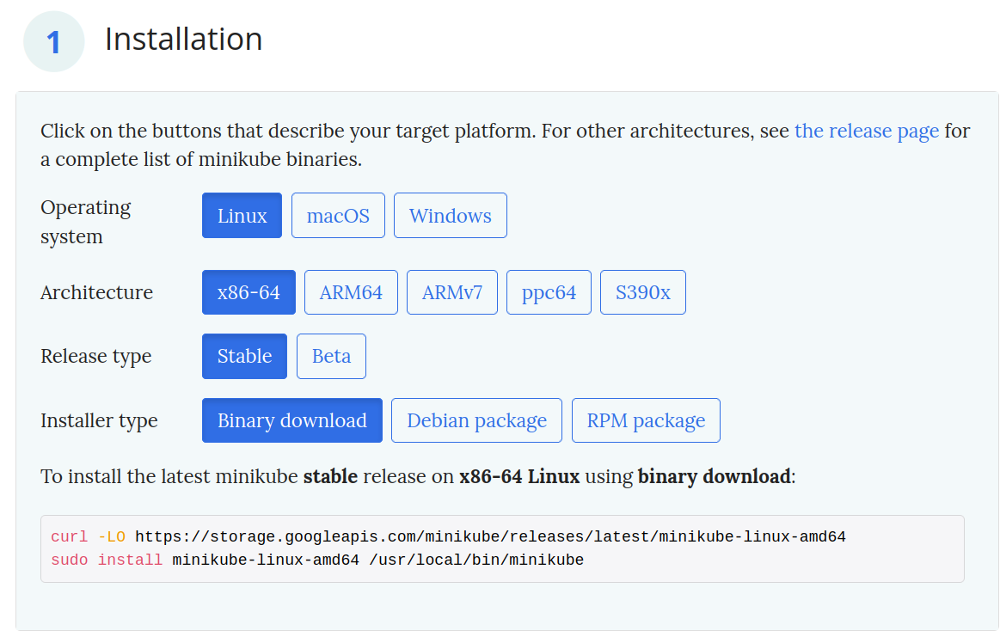

# Instalação do minikube

Instalando Minikube

A instalação do Minikube é rápida e fácil
Basta acessar o site: [https://minikube.sigs.k8s.io/docs/start/](https://minikube.sigs.k8s.io/docs/start/)

Escolha a sua distribuição e siga as instruções ali.

Segue informações detalhadas para instalação no Ubuntu.
Caso seu sistema operacional seja outro, utilize do site acima.

## Linux Ubuntu
>As etapas abaixo foram executadas em um computador desktop linux Ubuntu 20.04.5 LTS

acesse o site: [https://minikube.sigs.k8s.io/docs/start/](https://minikube.sigs.k8s.io/docs/start/) e escolha a opção como abaixo:



Execute os dois comandos informados e você terá o minikube instalado.

### Minikube Driver

O Minikube é uma forma de criar um cluster Kubernetes com um único node que faz o papel tanto do Worker Node como do Master Node.

Para que seja possível executar o Node Kubernetes há diferentes abordagens em como isolar (ou não) este ambiente.

As opções variam desde a utilização de máquinas virtuais até o próprio docker dentro do docker.

O recomendado para Ubuntu é uma das opções abaixo:
- Docker (No caso o inteiro Kubernetes cluster será UM ÚNICO container, com outro docker instalado, com containers)
- KVM2 - Máquina Virtual Kernel-Based
- VirtualBox - Máquina Virtual Normal

(O guia continuará na opção de utilizar o KVM2, caso escolha outra opção siga os passos como descrito na documentação no site oficial do minikube)

### KVM2

> As instruções abaixo são como descritas na documentação oficial [https://minikube.sigs.k8s.io/docs/drivers/kvm2/](https://minikube.sigs.k8s.io/docs/drivers/kvm2/)

O KVM2 (Kernel-Based Virtual Machine) é uma solução de virtualização bastante completa, e de forma a utilizá-la junto com minkube é necessário primeiro instalar este programa no seu ubuntu.

1. **Verificar se o seu sistema suporta Virtualização**

Para executar o KVM, você precisa de um processador que suporte a virtualização de hardware. Intel e AMD desenvolveram extensões para seus processadores, considerados respectivamente Intel VT-x e AMD-V Para ver se o seu processador suporta um desses, você pode revisar a saída deste comando:

```
egrep -c '(vmx|svm)' /proc/cpuinfo
```

Se 0 significa que sua CPU não suporta virtualização de hardware.

Se for 1 ou mais, mas você ainda precisa ter certeza de que a virtualização está habilitada no BIOS.

Outra forma de verificar é com o utilitário kvm-ok

```
sudo apt install cpu-checker
kvm-ok 
```

Se a saída do comando for:

>```
>INFO: /dev/kvm exists
>KVM acceleration can be used
>```

É porque seu computador suporta virtualização

2. **Instalar os pacotes necessários**

Abaixo segue o comando para instalação do kvm

```
sudo apt-get install qemu-kvm libvirt-daemon-system libvirt-clients bridge-utils virt-viewer
```

3. **Permissão de Usuário e Grupo**

Após todo a operação terminar, execute os comandos abaixo para ser inserido no grupo de usuário correto

```
$ sudo adduser `id -un` libvirt
Adding user '<username>' to group 'libvirt' ...
$ sudo adduser `id -un` kvm
Adding user '<username>' to group 'kvm' ...
```

### Validando instalação KVM2
Se tudo der certo com a instalação do KVM
o comando abaixo deve produzir:

```
erickweil@WFSLab:~/git/testes-k8s$ virsh list --all
 Id   Name   State
--------------------


```

Que indica que não há nenhuma máquina virtual.

## Iniciando Minikube

Caso tudo tenha acontecido como deveria, podemos iniciar o Minikube:

```
minikube start --driver=kvm2
```
>```
>erickweil@WFSLab:~/git$ minikube start --driver=kvm2
>😄  minikube v1.28.0 on Ubuntu 20.04
>✨  Using the kvm2 driver based on user configuration
>💾  Downloading driver docker-machine-driver-kvm2:
>    > docker-machine-driver-kvm2-...:  65 B / 65 B [---------] 100.00% ? p/s 0s
>    > docker-machine-driver-kvm2-...:  12.20 MiB / 12.20 MiB  100.00% 349.49 Ki
>💿  Downloading VM boot image ...
>    > minikube-v1.28.0-amd64.iso....:  65 B / 65 B [---------] 100.00% ? p/s 0s
>    > minikube-v1.28.0-amd64.iso:  274.45 MiB / 274.45 MiB  100.00% 21.45 MiB p
>👍  Starting control plane node minikube in cluster minikube
>💾  Downloading Kubernetes v1.25.3 preload ...
>    > preloaded-images-k8s-v18-v1...:  385.44 MiB / 385.44 MiB  100.00% 20.67 M
>🔥  Creating kvm2 VM (CPUs=2, Memory=6000MB, Disk=20000MB) ...
>🐳  Preparing Kubernetes v1.25.3 on Docker 20.10.20 ...
>    ▪ Generating certificates and keys ...
>    ▪ Booting up control plane ...
>    ▪ Configuring RBAC rules ...
>🔎  Verifying Kubernetes components...
>    ▪ Using image gcr.io/k8s-minikube/storage-provisioner:v5
>🌟  Enabled addons: default-storageclass, storage-provisioner
>💡  kubectl not found. If you need it, try: 'minikube kubectl -- get pods -A'
>🏄  Done! kubectl is now configured to use "minikube" cluster and "default" namespace by default
>
>```
